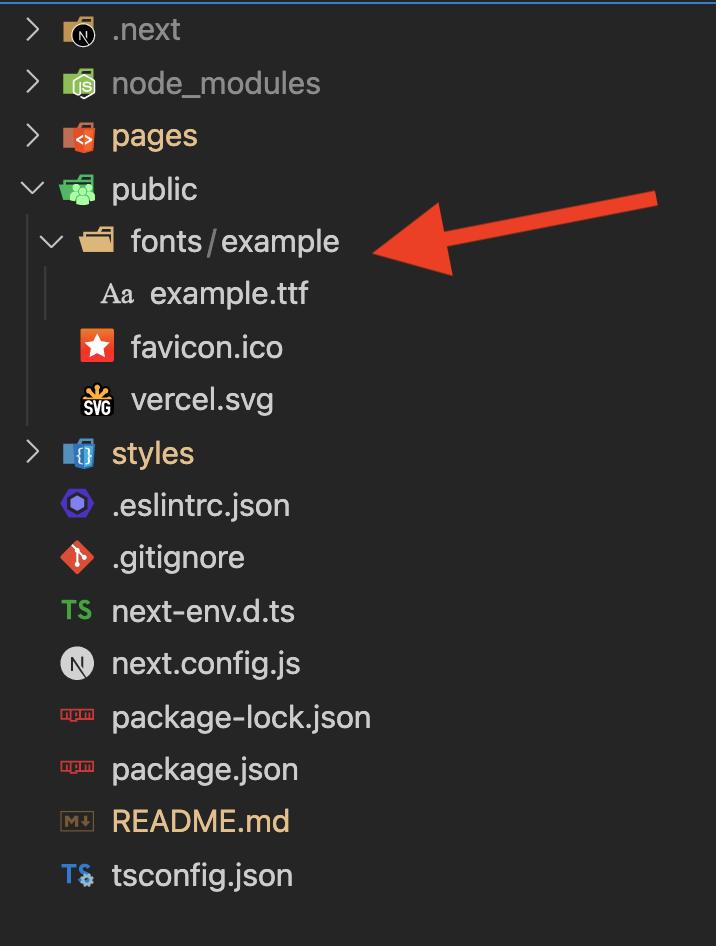
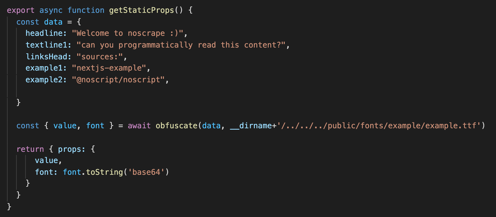
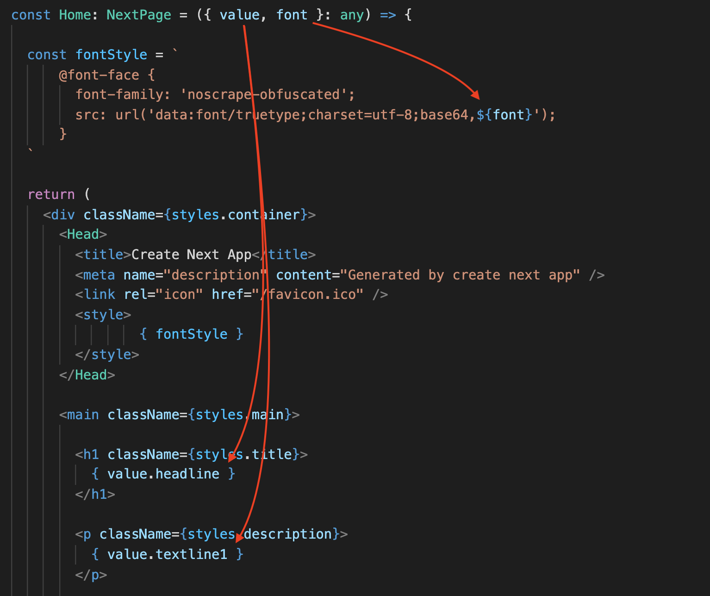
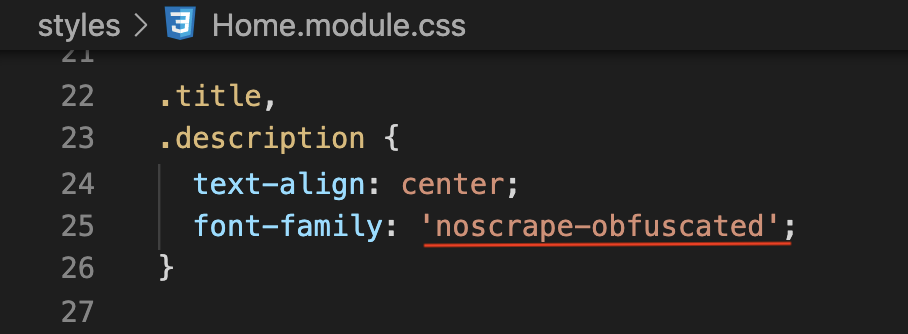

## Getting Started with nextjs + noscrape

 
 

### put any truetype fontfile in public/fonts/ - folder

 
 

### translate any data (static example)

 
 

### insert translated data and font-family

 
 

### set font-family

 
 

